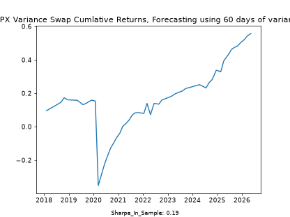
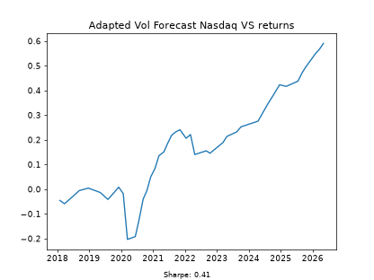

# Conculsions
- NASDAQs relationship to volatility is different to our SPX
- Variance swaps are short vol of vol
- Improving volatility forecast improves Sharpe Ratio


## Variance swaps are short 'vol of vol'
As I point out in [Backtest](<Variance_swap_trading/backtest.md>) for the out of sample test, the sharpe ratio for the whole period is 0.08, However, when we remove the large drawdown period of 2020 our sharpe ratio rises to 1. This shows us that when we take short volatility postions there are large tail risks, because of the fact variance is 'short vol of vol', We can show this by doing some simple calculas:

$$
P(T) = N \times (K_{\text{var}} - v(T) ) 
$$

This is the payoff of a short variance swap 

$$
\frac{dP(T)}{d\sigma} = -2N\sigma
$$

$$
\frac{d^2P(T)}{d\sigma^2} = -2N
$$

We can see that changes in the volatility are negative for the payoff. 

## Chaning the Volatility Forecast

When we change our variance forecast to be a weighted average of the previous rolling 15,30,60,90 annulsied volatilities. we can improve our sharpe ratio, from 0.08 to 0.19 for our S&P 500 model. 

```python
prev_15_day_var = log_return_daily.rolling(15).var() *252
prev_30_day_var = log_return_daily.rolling(30).var() *252
prev_60_day_var = log_return_daily.rolling (60).var() *252
prev_90_day_var = log_return_daily.rolling(90).var() *252

forecast_variance = 0.5*prev_15_day_var + 0.3*prev_30_day_var + 0.15*prev_60_day_var + 0.05*prev_90_day_var
```




In the future It would be intresting to test these methods against eachother, seeing which creates the best forecast for volatility. 

## Tech Stocks seem to have a higher VRP




Here we observe, using our updated volatility forecasting that selling or buying volatility when it is under or overpriced performs much better for the NASDAQ. The NASDAQ consists of tech stocks, a observation could be that tech stocks usually have higher VRPs due to possible notions of pre- profit or the potential of technology being generally over hyped, pushing up implied volatities, which creates an oppourinty for shorting vol more lucrative. What would be intresting is to apply this to single stock options chains and 


