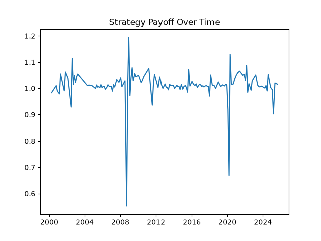
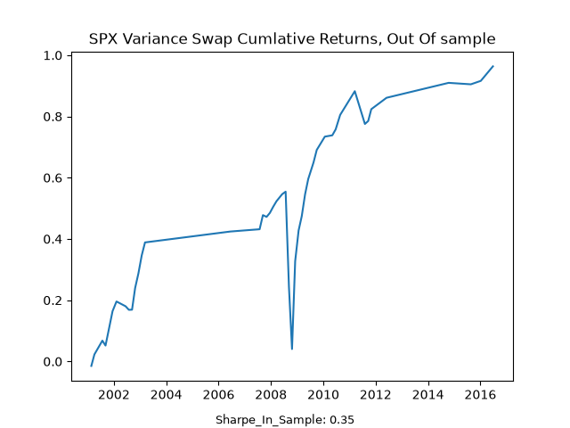

# Backtesting our variance swap stratergy

Here I attempt to create a backtest for a variance swap strategy, deciding to enter a position based on previous volatility as a future forecasted voltiltiy. This is certianly an area that can be improved possibly using Garch to model future volatility. From Here we decide to enter a postion based on the deviations from the mean. Here I return the returns in addative variance points.

## Libaries
```python
import matplotlib.pyplot as plt
import pandas as pd   
import yfinance as yf
import numpy as np
```

# Downloading our SPX and VIX data  

as mentioned in [Variance Swaps](<Variance_swap_trading/variance_swap.md>), We can use the VIX hisotrical prices as a proxy for our $ K_{\text{var}} $ value because of the VIX's methology, they both use a $ \frac{1}{K^2}$ strip of OTM options to come up with the markets estimation of future volatility. The problems with using this as a proxy is that we assume we can enter a variance swap at directly the $ \frac{1}{K^2}$ value given. This is an intresting point as buy enterting a varaince swap, we are shifting the replication to a market maker which may bring additonal costs. 

```python
spx = yf.download("^GSPC", start="2000-01-01", end="2026-01-01")
vix = yf.download("^VIX", start="2000-01-01", end="2026-01-01")
prices_spx = spx["Close"].squeeze()
prices_vix = vix["Close"].squeeze()
```

# Daily log prices for the S&P 500

Going back to the orginal motivation for this project [Z. Kakushadze and J.A. Serur. 151 Trading Strategies] we use the formula outline in [Variance Swaps](<Variance_swap_trading/variance_swap.md>), again calcualting the log daily changes in price and squaring, then summing them unitl contract maturity. 

```python
log_return_daily = np.log(prices_spx).diff()
Kvar = (prices_vix / 100) ** 2
```

# Forecasting Volatility 

here we use a previous months variance to forecast the next 30 days, in the future I hope to change this possibly comparing different forecasts for volatilty.   
```python
window = 21
daily_variance_forecast = log_return_daily.rolling(window).var()

forecast_30d_variance = (252/window) * daily_variance_forecast
```

 So we have our log prices now we can make signal

 rules we will implement

#we go long/ short variance depending on our expectation for variance

 our signal is Kvar - E[RV], the markets expected variance vs ours

 this is VRP

# Defining The volatiltiy risk premium

This is a topic I have been fasicnated by for over 3 years, I 


[Carr and Wu, 2009]

```python
vrp = Kvar - forecast_30d_variance

roll_mean = vrp.expanding(min_periods=252).mean()

roll_std = vrp.expanding(min_periods=252).std()

vrp_z = ((vrp - roll_mean) / roll_std).dropna()

vrp_z = vrp_z[vrp_z.index < "2018-01-01"]      # in-sample
#vrp_z = vrp_z[vrp_z.index >= "2018-01-01"]   # out-of-sample

print(vrp_z)
```


# Signal Creation

I adapt my signal generation from my pairs trading stratergy, as it is the same basic concept of mean reversion. Here I enter when the VRP is either too high or too low. This was good pratice of python general concepts lists, dicts and such, which I learnt from my programming module and kaggle course. Possibly in the futuer as i study "Mastering Python For Finance", I hope to be able to learn how to programme more complicated stratergies such as introducing a weighting factor. 
```python
position = 0  # 0 nothing, 1 long var swap, -1 short var swap

positions = []
entry_req = 0.5
Trading_days = 0

for z in vrp_z:
    entry_today = 0

    if position == 0:

        if z > entry_req:  
            position = -1
            entry_today = -1
            Trading_days = 0

        elif z < -entry_req:
            position = 1
            entry_today = 1
            Trading_days = 0

    else:

        Trading_days += 1  # this is so we dont enter another swap until its matured

        if Trading_days >= 30:
            position = 0
            Trading_days = 0

    positions.append(entry_today)

positions_series = pd.Series(
    positions,
    index=vrp_z.index,
    name="Position"
)
```
# Removing Rows 
Here I remove the rows where no trades are entered, so it just returns the date and value of the postion(long or short). Entry record here is importat as it gives us the start date of the swap and then from there calculate the payoff of the swap, reciving the $ K_{\text{var}} $ value when shorting and then paying the realised. 

```python
entry_record = positions_series[positions_series != 0]

positions_series = pd.Series(
    positions,
    index=vrp_z.index,
    name="Position"
)
```
# Make a record of date entered swap

Here we make a record of the dat entered the swap and then calucated the next 30 realised vol,  

```python
realised_var_30d = {}

for date in entry_record.index:

    loc = log_return_daily.index.get_loc(date)

    # find the next 30 days of log returns
    future_returns = log_return_daily.iloc[
        loc + 1 : loc + 1 + window
    ]

    if len(future_returns) == window:

        realised_var_30d[date] = (
            (future_returns ** 2).sum()
            * (252 / window)
        )

    else:

        realised_var_30d[date] = np.nan


realised_var_30d = pd.Series(
    realised_var_30d,
    name="RealisedVar_30d"
)

payoff = position * (
    realised_var_30d -
    Kvar.loc[entry_record.index]
)

var_swap_return = 1 + payoff
```

# Stratergy Return per swap

```python
plt.plot(var_swap_return)

plt.title("Strategy Payoff Over Time")

plt.savefig(
    "Variance_swap_trading/Figures/variance_swap_return_spx"
)

plt.close()
```


## Performance metrics

Here i calculate the Cumlative payoff, here I use the cumlative sum because varaince being addative, as i keep my returns in variance points. In the future I will change it into vega units. The number of payoffs is jsut the number of trades, so i use an average of trades per year.

```python
cumulative_payoff = payoff.cumsum()

mean_payoff = payoff.mean()

std_payoff = payoff.std()

sharpe_per_payoff = mean_payoff / std_payoff

trades_per_yr = len(payoff) / 26

sharpe_annual = (
    sharpe_per_payoff *
    np.sqrt(trades_per_yr)
)

print(sharpe_annual)
```


## The graph

Now here is the plot of 

```python
plt.plot(cumulative_payoff)

plt.title("SPX Variance Swap Cumlative Returns")

plt.savefig(
    "Variance_swap_trading/Figures/cumlative_variance_swap_return"
)
plt.close()
```
 


The large reduction in sharpe, can possilby be explained by reduced underfitting and large expsoure to tail risk. The large drawdowns across equites causes a change in volaility, as variance swaps are short 'vol of vol'. We see this when we exculde the year 2020 we get a sharpe ratio of 1. 


## References

Kakushadze, Zura and Serur, Juan Andrés, 151 Trading Strategies (August 17, 2018). Z. Kakushadze and J.A. Serur. 151 Trading Strategies. Cham, Switzerland: Palgrave Macmillan, an imprint of Springer Nature, 1st Edition (2018), XX, 480 pp; ISBN 978-3-030-02791-9, Available at SSRN: https://ssrn.com/abstract=3247865
