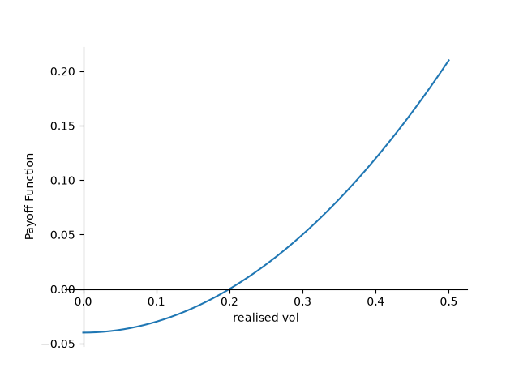

 # Methodology of Backtesting Variance swaps

 # Table of Contents
- [Introducing Variance Swaps](#introducing-variance-swaps)
- [Dicussion of Methodlogys](#dicussion-of-methodlogys)
- [Backtest](#backtest)

## Introducing Variance Swaps

Variance Swaps are a derivative contract, that pays the realized votltity over at time $ T $ compared to a pre agreeed upon variance, called the strike in this case. Here the investor in the variance swap views volitliy as an asset class instead of a metric of risk. 

To start off with some maths we have to establish the payoff of the variance swap. As done in '151 Trading Strategys', lets define the payoff of a varaiance swap at maturity time T. as
$$
P(T) = N \times (v(T)- K) 
$$
where $ v(T) $ is the realized variance at time T and the variance strike K, the value of which $ P(T) = 0$. In the file [Variance Swaps Trading](<Variance _swap_trading/variance_swap_trading.py>)

we get the payouts of a voltiltiy swap at each of the realzied volitites, accoridng to a swap with a strike volitiiy of 20%. Here we see a variance swap has a convex payoff function, why might this be? because of the nature of varaince being volitility squared, hence the payoff is a quadratic fucntion causing convexity of returns, which is much more attractive than linear payoffs. 

if we look at when 
$$
 P(T) = 0 \rightarrow v(T) = k 
$$
$$
v(T) = k \rightarrow \sigma ^2 = k $ where $\sigma $ is the realised vol
$$
If you are shorting a variance swap you belvie that the realised voltilty will be less than the market actually thinks, and vice versa.

## Dicussion of Methodlogys

 So how do we find out what k, the rate of volatiltiy the makret expects. Here are a few ways I find intresting and hopefully can approach as I progress further into my Mathematics education: 

1. Replication and Rules of thumb

2. using VIX as a proxy(slighty different from replication)

3. Estimating using the voltaitlty surface

Lets Address the first one, This idea comes from Carr & Madan (1998), “Towards a Theory of Volatility Trading” 

"
*By combining static positions in options with dynamic trading in futures, payo s related to realized volatility can be achieved whichhave either no exposure to price, or whichhave an exposure contingent on certain price levels being achieved in spefcied time intervals*" 

Here they discover using static postions in options, a strip of OTM options and then hedging with futures to remove directionality they are left with quadratic variance payoffs. Then Demeterfi, Derman, Kamal & Zou (1999), “More Than You Ever Wanted to Know About Volatility Swaps” come up with the modern replication formula that is used commonly today. In [Carr & madan (1998)] they prove for any twice differentiable payoff fucntion, they can be written by a static replication of options, then Demeterfi, Derman, Kamal & Zou they derive for log replication and adress many key problems.

$$
K_{\text{var}} = \sqrt{\frac{2}{T}
\left(
\int_0^{F} \frac{P(K)}{K^2}\, dK
+
\int_F^\infty \frac{C(K)}{K^2}\, dK
\right)}
$$

Here we have our main fomurla, we can do some maths to get an idea of where this $ 1/ (K^2) $ term comes from. As we said earlier any twice differential fucntion can be written as a static repliaction of OTM puts and calls. From the orginal paper we metioned 151 trading stratgies:

we have 

$$ 
v(t) = \frac{F}{T} \sum_{t=1}^{T} R^2(t)
$$
$$
R(t) = ln(\frac{S(t)}{S(t-1)}) = ln S(t) - ln S(t-1)
$$

variance swaps pay the second term, the method to reaching the main formula goes by turning the $ v(t)$ into Carr and Madans formula from here you can set $ f(x) = ln(x) $ then using some simple calculas to get $ f''(x) = -\frac{1}{x^2}$ so you can see where the weighting of $ \frac{1}{K^2}$ comes from. 

Here we have just adressed our Replication method of devleoping a way to come up with our value for $ K_{\text{var}} $. There are a few issues it firstly, assumes a contiumation of strikes, the $ \frac{1}{K^2}$ weighting means deep OTM puts have a large impact. This is certinaly a whole another topic in itself. 

This is why firms and pratcioners commonly use the 90% put option implied volility, what this is saying for a underlying strike price $\lambda$, we use $0.9\lambda$. This value is used becasue of less moneyess having a higher weighting. 

90% strike 1/(0.9)^2 = 1.2346

80% strike 1/(0.8)^2 = 1.5625

70% strike 1/(0.7)^2 = 2.0408

So for the $ \frac{1}{K^2}$ weighting we see that deep OTM has a larger impact the 70% strike has a 65% larger impact than the 90%. But what does this change in weighting cause, in a paper Bondarenko, " Why are put options so expensive", to quote 

"*put options appear to be grossly overpriced*" 

"*average excess return .... is as low as -95% per month for deep out the money (OTM) puts*" 

so going back to our formula higher option prices leads to a higher $ K_{\text{var}} $, this takes into effect the voltility skew.

So finally our method will be using, using VIX as a proxy. The vix uses the same excat method as Demeterfi, Derman, Kamal & Zou. However, Vix just square roots the solution then mutiplys it by 100. As I do have access to historical VIX data and S&P 500. Now we are in a postion we can estimate values for $ K_{\text{var}} $ and $ v(T) $. The only difference is VIX uses the CBOE interplotion method.

## [Backtest](<backtest.md>)

The maths outlined above leds us to us VIX as a propety $ K_{\text{var}} $ 

## References

